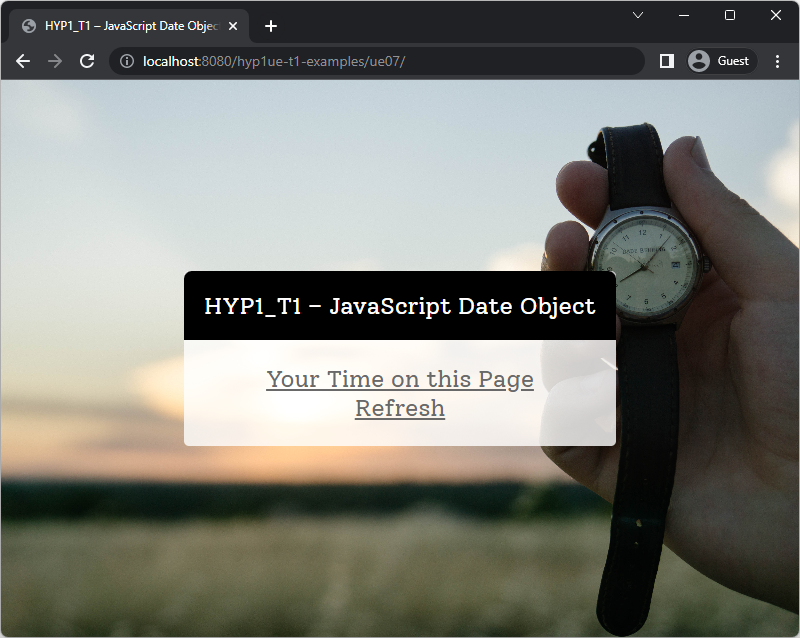
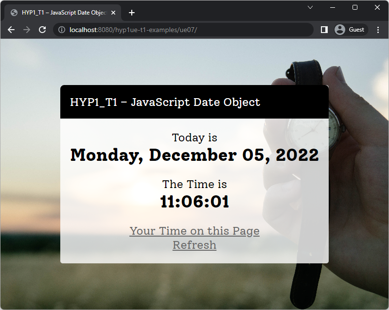
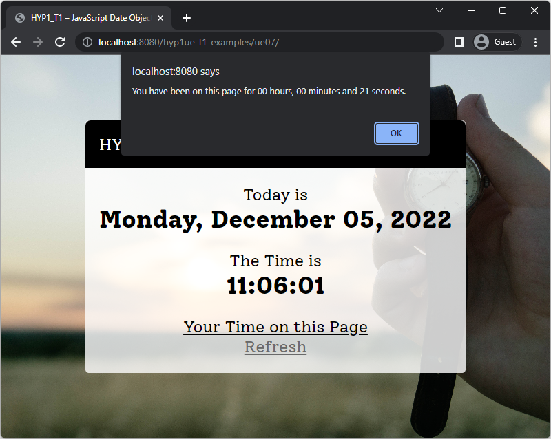

# Übung 2 JavaScript Teil 2: Objekte im Browser

Zum Kennenlernen des Objektbegriffs und der Ausgabe im Browser in JavaScript soll mit dem Datumsobjekt gearbeitet werden. Es sollen das aktuelle Datum und die Uhrzeit ausgegeben werden. Auf Klick soll angezeigt werden, wie lange die aktuelle Seite bereits geöffnet ist und eine Möglichkeit bestehen, die Seite neu zu laden.

## Die HTML-Datei

Gegeben ist eine einfache HTML-Datei `index.html` mit dem Standard-HTML-Grundgerüst. Diese soll zu Beginn mit den nötigsten Inhalten erweitert werden. In diese Elemente werden im Anschluss per JavaScript die Inhalte eingefügt. Überlegen Sie sich ein ansprechendes (nicht zu aufwendiges) Layout. Die Abbildung zeigt das Dokument noch ohne JavaScript-Inhalte, beim Klicken der Links passiert außerdem nichts.

|  |
|:--------------------------------------------------------------------------------------------------------------------------------------------------------------------------------------------:|
|                   **Beispiel wie es aussehen kann**                    |

## Die JavaScript-Datei

Legen Sie nun eine externe JavaScript-Datei (Textdatei, beliebiger Name, Endung `.js`) an und binden Sie diese im `<head>` Ihres Dokuments ein. Dies ist notwendig, damit die Funktionsdefinitionen rechtzeitig bekannt sind, wenn sie im `<body>` aufgerufen werden. Definieren Sie in der Datei nun Funktionen für verschiedene Aufgaben:

- Eine Funktion `currentDay()`, die das aktuelle Datum ermittelt und ausgibt. Im Datum sollen folgende Dinge enthalten sein: Wochentag, Tag, Monat (als Kalendermonat, nicht als Zahl), aktuelles Jahr (z.B. Tuesday, December 06, 2022).
- Eine Funktion `currentTime()`, die die aktuelle Uhrzeit ermittelt und ausgibt. Die Uhrzeit soll aus Stunde, Minute, Sekunde bestehen (z.B. 11:09:37).
- Eine Funktion `addLeadingZero(value)`, die mit einem Parameter aufgerufen wird und wenn nötig, an Zahlen eine führende Null davor hängt, um bei Tag, Stunde, Minute und Sekunde sicherzustellen, dass diese immer mit führender Null angezeigt werden. Der neue Wert mit führender Null wird dann mittels `return` zurückgegeben. Diese Funktion dient als reine Hilfsfunktion und soll immer dann aufgerufen werden, wenn die Datums- und Zeitfunktion ihren Output schreiben, denn das `Date`-Objekt gibt die Uhrzeit immer ohne führende Null zurück.
- Eine Funktion `timeOnPage()`, die mittels `alert()` ausgibt, wie lange die aktuelle Seite (Stunden, Minuten, Sekunden) bereits im Browser geöffnet ist. Ein Reload setzt diese Angabe (automatisch) immer wieder auf 00:00:00 zurück.
- Eine Funktion `refresh()`, die einen Reload der aktuellen Seite ausführt.

## Verwendung der JavaScript-Funktionen & Hinweise

- Verwenden Sie `innerText` oder `innerHTML` in ihren Funktionen, um HTML-Output (wie Datum und Uhrzeit) zu generieren. 
- Das `Date`-Objekt ist ein vordefiniertes Objekt, das im Browser zur Verwendung bereitsteht, sie müssen sich aber mit `new` eine Instanz (bzw. vermutlich mehrere) davon anlegen. Informationen zum Objekt und dessen Methoden sowie Verwendungsbeispiele finden sie bei [MDN](https://developer.mozilla.org/en-US/docs/Web/JavaScript/Reference/Global_Objects/Date) oder auch bei [SELFHTML](https://wiki.selfhtml.org/wiki/JavaScript/Objekte/Date/Einführung).
- Die Methoden, die den Wochentag sowie den aktuellen Monat liefern, geben diese Werte als Zahl (0 für Sonntag (!), 1 für Montag, ..., 6 für Samstag, bzw. 0 für Januar, 1 für Februar, ..., 11 für Dezember) zurück. Erledigen Sie die Zuordnung zu den textuellen Repräsentationen (Sonntag, Montag, Dienstag, ..., Januar, Februar, ...) jeweils über Arrays. Legen Sie sich also Arrays mit den Wochentagen und Monatsnamen an und greifen Sie dann über die Index-Zahl, die Sie von der jeweiligen Methode des Date-Objekts bekommen, zu.
- Platzieren Sie die Funktionen zum Anzeigen von Datum und Uhrzeit an der richtigen Stelle im `<body>` des HTML-Dokuments, sodass sie beim Laden der Seite automatisch aufgerufen werden und den Output an der gewünschten Stelle anzeigen. Die folgende Abbildung verdeutlicht dies.

|  |
|:-------------------------------------------------------------------------------------------------------------------------------------------------------------------------------------------------------------:|
|                   **Nach dem Laden der Seite werden automatisch die JavaScript-Funktionen zum Anzeigen von Uhrzeit und Datum aufgerufen. Diese fügen die zwei Zeilen über den Links ein.**                    |

- Rufen Sie die Funktionen zum Anzeigen der Verweildauer auf der Seite sowie für den Refresh-Button in einem Hyperlink mit dem Pseudoprotokoll `javascript:` auf, wie in der folgenden Abbildung gezeigt. Dies gibt die Verweildauer aus.

|  |
|:------------------------------------------------------------------------------------------------------------------------------------:|
|                   **Nach dem Klick auf "Your time on this page" wird die Verweildauer auf der Seite ausgegeben.**                    |

- Um die Zeitdifferenz für die Verweildauer zu berechnen, können Sie die Millisekunden seit 1.1.1970 eines `Date`-Objekts von denen eines zweiten abziehen und mit dieser Differenz ein neues Objekt erzeugen, das nur noch die Differenz enthält. Beachten Sie dabei, dass bei der Ausgabe der Stunde(n) die Zeitzone (derzeit UTC+1 für die Winterzeit) hinzugerechnet wird. Verwenden Sie daher bei der Ausgabe der Verweildauer die diversen UTC-Funktionen des `Date`-Objekts wie z.B. `getUTCHours()` (welche Zeiten in UTC, also ohne Zeitzonen-Offset, ausgeben).
- Die Eigenschaften des `window`-Objekts und dessen Eigenschaften können beim Reload und für die Ausgabe mit der Funktion `alert()` hilfreich sein. Beispiele finden sich bei [MDN](https://developer.mozilla.org/en-US/docs/Web/API/Window) und [SELFHTML](http://wiki.selfhtml.org/wiki/Window). 

## Tipps und Richtlinien

- Die Chrome DevTools und ähnliche Werkzeuge anderer Browser zeigen generierten JavaScript-Code an.
- Falls Sie schon mit JavaScript Erfahrungen haben und etwa mit dem DOM vertraut sind, können Sie die Ausgaben auch damit erledigen. Das DOM ist ansonsten Inhalt von Vorlesung 10 und Übung 8.
- Bei Fragen oder Problemen zur Aufgabe verwenden Sie den Pull Request "Feedback" oder eröffnen Sie Issues. Alternativ können Sie Fragen auch in Microsoft Teams stellen.
